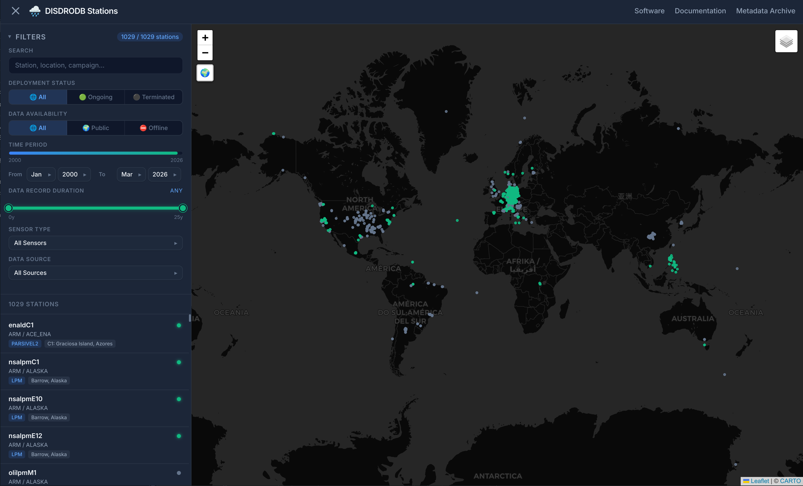

# Welcome to the DISDRODB Metadata Archive

📖 **Documentation**: [disdrodb.readthedocs.io](https://disdrodb.readthedocs.io/en/latest/)
💻 **Software repository**: [DISDRODB](https://github.com/ltelab/disdrodb)

______________________________________________________________________

## About DISDRODB

DISDRODB is an international initiative to **index, collect, and harmonize drop size distribution (DSD) data** from disdrometers around the world.

The project also aims to establish a **global standard for sharing disdrometer observations**, following:

- **FAIR data principles** (Findable, Accessible, Interoperable, Reusable)
- **CF conventions** (Climate & Forecast metadata standards)

By adopting these standards, DISDRODB facilitates the **processing, analysis, and visualization** of disdrometer data across diverse datasets and institutions.

______________________________________________________________________

## Content of this repository

This repository hosts the **DISDRODB Metadata Archive**, which serves as the central registry for:

- 📍 **Station Inventory**: catalog of all available disdrometer sites

- 🛠️ **Station Status**: a record of problematic timesteps or time periods affected by station malfunctions

- 💾 **Raw Data Archives**: URLs linking to the original disdrometer data repositories

By using GitHub, the community can collaboratively:

- Improve and correct station metadata
- Track sensor performance over time
- Enhance data quality with a transparent, reproducible workflow

All metadata follow a comprehensive [standardized schema](https://disdrodb.readthedocs.io/en/latest/metadata.html) to ensure consistency.

Contributors can also report instrument malfunctions or erroneous measurements through dedicated issues YAML files, making it easy to document anomalies.

______________________________________________________________________

## 🌍 Interactive stations map

Click on the image below to access the **full-screen interactive map** of all DISDRODB stations:

[](https://ltelab.github.io/disdrodb-webmap/)

______________________________________________________________________

## DISDRODB Metadata Archive structure

The DISDRODB Metadata Archive is organized by data sources and campaigns.
Each `<DATA_SOURCE>` (e.g., `EPFL`) contains one or more `<CAMPAIGN_NAME>` (e.g., `HYMEX_LTE_SOP3`), which in turn contain station-level metadata.

```
  📁 DISDRODB
  ├── 📁 METADATA
      ├── 📁 <DATA_SOURCE>
          ├── 📁 <CAMPAIGN_NAME>
              ├── 📁 issue
                  ├── 📜 <station_name_1>.yml
                  ├── 📜 <station_name_2>.yml
              ├── 📁 metadata
                  ├── 📜 <station_name_1>.yml
                  ├── 📜 <station_name_2>.yml  
```

- **Metadata YAML files** → contain station information (device type, position, reader, data URLs, etc.) needed for integration and processing.
- **Issue YAML files** → document time periods of malfunctioning instruments or erroneous data that must be excluded during processing.

______________________________________________________________________

## 📌 Frequently Asked Questions (FAQs)

- [How to Download DISDRODB data?](https://disdrodb.readthedocs.io/en/latest/quick_start.html)
- [How to Update the DISDRODB Metadata Archive ?](https://disdrodb.readthedocs.io/en/latest/metadata_archive.html)
- [How to Contribute New Data to DISDRODB ?](https://disdrodb.readthedocs.io/en/latest/contribute_data.html)
- [What are the DISDRODB Contributing Guidelines ?](https://disdrodb.readthedocs.io/en/latest/contributors_guidelines.html)
