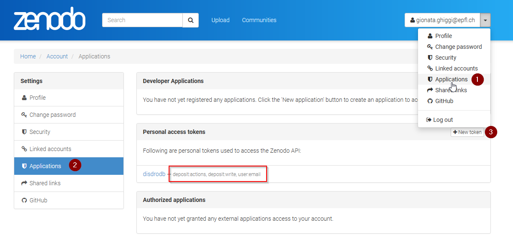

# Upload data to zenodo

## Installation

### Python

Intsall the required packages : 

    pip install -r requirements.txt

Tips : Consider creating a virtual environment before installing requirements to prevent conflicts with other packages.

Ubuntu :

    python3 -m venv venv
    source venv/bin/activate

Windows :

    python -m venv venv
    cd venv/Script
    activate

### Zendodo

1. Create a Zenodo access token with write scope is necessary to access depositions and files. Save it under `secret.yml`  (you can use the `secret_template.yml` as example).       

2. Create a zenodo repository

3. Start a new version, copy the id_session from the url

4. Run the code from `disdrodb-data/app/upload_to_zenodo/`  as follow: 

```shell
python upload_2_zenodo.py -path_ini 'folder path' -session_id 123456789 -incremental_loading True
```

 for example : 

```shell
python upload_2_zenodo.py -path_ini '/ltenas8/data/disdrodb-data/disdrodb/Raw/EPFL/TEST_RL' -session_id 7568721 -incremental_loading True
```
